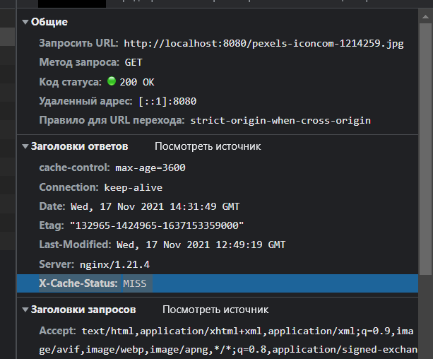
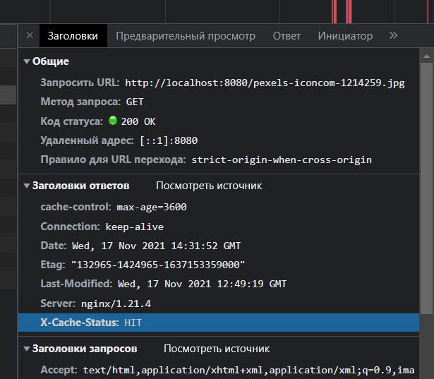
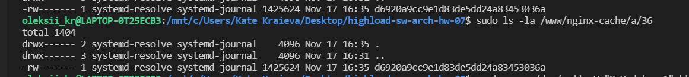
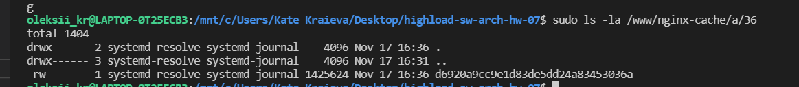

# highload-sw-arch-hw-07

# Prerequisites
* docker
* linux + bash

# 1. Run nginx + app which serves static files
```
./run.sh
```

# 2. Make request in browser
```
http://localhost:8080/pexels-iconcom-1214259.jpg
```

# 3. Observe that first 2 requests are with response header X-Cache-Status: MISS



# 4. After that responses will be with X-Cache-Status : HIT



# 5. Also cache will be in /www/cache mounted volume



# 6. For force cache update run following request

```
curl -s -o /dev/null -H "X-Update: 1" http://localhost:8080/pexels-iconcom-1214259.jpg
```

# 7. Observe that cache write time changed to new one



# 8. Run cleanup script

```
./cleanup.sh
```